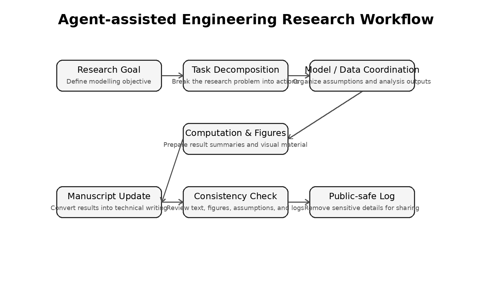

# engineering-research-agent

# Agent-Assisted Research Workflow for Engineering Modelling

This repository presents an Agent-assisted research workflow designed to support complex engineering modelling, simulation analysis, model validation, and manuscript preparation.

The project explores how AI agents can be integrated into a scientific research process to reduce repetitive manual work, improve reproducibility, and accelerate iterative model development.

## Project Motivation

Engineering research often involves repeated cycles of theoretical modelling, numerical simulation, data processing, figure generation, manuscript revision, and result verification. These tasks are usually distributed across multiple tools and require substantial manual coordination.

This project proposes a structured Agent-driven workflow that helps researchers connect these steps into a more coherent and traceable pipeline.

## Core Workflow

The Agent-assisted workflow includes the following stages:

1. Problem understanding and task decomposition  
2. Model formulation and assumption checking  
3. Data processing and result organization  
4. Figure and table generation  
5. Manuscript revision and technical writing  
6. Consistency checking and output summarization  

The goal is not to replace scientific judgement, but to provide an intelligent assistant that supports repetitive, structured, and documentation-heavy research tasks.

## Agent Capabilities

The workflow demonstrates how an AI Agent can assist with:

- organizing research objectives;
- translating scientific assumptions into computational procedures;
- coordinating scripts and document-generation tasks;
- producing reproducible summaries of model updates;
- checking consistency between figures, tables, and manuscript text;
- generating sanitized logs for review and reporting.

## Repository Contents

```text
docs/
  Public-safe project logs and workflow documentation.

figures/
  Conceptual diagrams of the Agent-assisted research pipeline.

prompts/
  Example prompts used to guide Agent behaviour in research tasks.

examples/
  Demonstration outputs showing how the workflow summarizes results.

## Workflow Diagram



## Documentation

- [Workflow overview](docs/workflow_overview.md)
- [Agent design](docs/agent_design.md)
- [Privacy and sanitization](docs/privacy_and_sanitization.md)
- [Public-safe run log](docs/run_log_public_safe.md)

## Example Prompts

- [Research Agent prompt](prompts/research_agent_prompt.md)
- [Manuscript revision prompt](prompts/manuscript_revision_prompt.md)
- [Run-log sanitization prompt](prompts/run_log_sanitization_prompt.md)

## Workflow Diagram


## Documentation

- [Workflow overview](docs/workflow_overview.md)
- [Agent design](docs/agent_design.md)
- [Privacy and sanitization](docs/privacy_and_sanitization.md)
- [Public-safe run log](docs/run_log_public_safe.md)

## Example Prompts

- [Research Agent prompt](prompts/research_agent_prompt.md)
- [Manuscript revision prompt](prompts/manuscript_revision_prompt.md)
- [Run-log sanitization prompt](prompts/run_log_sanitization_prompt.md)
